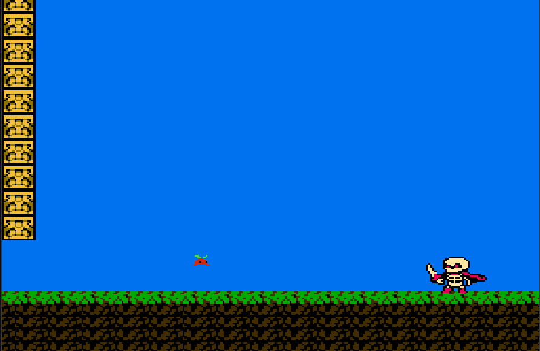

# NES Demo

This is an NES demo to help me understand some of the inner workings of the NES architecture. It's also my humble tribute after visiting the Nintendo Development Center in Kyoto. 

A big thank-you to Anders Gullmarsvik for [this amazing tileset](https://itchabop.itch.io/trapmoor-an-8bit-platformer-tileset). 



## Development environment

Install ca65 and ld65 from the cc65 suite.

```bash
sudo dnf install cc65
```

Install fceux for debugging.

```bash
sudo dnf install fceux
```

## Build

```bash
make
```

## Run

```bash
make run
```
